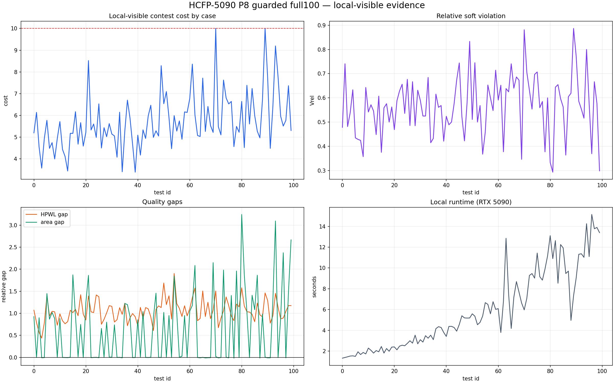
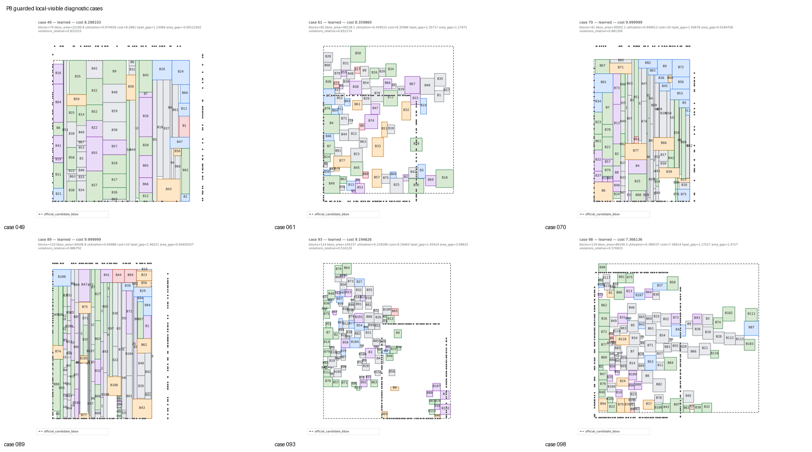

# HCFP-5090 current visual status

## Current guarded result

The current promoted solver result remains the P8 guarded portfolio. The
figures below are local-visible evidence rendered from
`artifacts/benchmarks/hcfp5090-p8-guarded-full100.json`; they are not hidden
contest results.

| Metric | P8 guarded |
| --- | ---: |
| weighted local cost | **6.414040** |
| hard feasible | **100/100** |
| cases below cap | **98/100** |
| wins / ties / regressions vs P7 | **48 / 52 / 0** |
| runtime p50 / p95 on RTX 5090 | **4.862 / 13.120 s** |
| median relative soft violation | **0.5732** |
| median area gap | **0.0092** |
| median HPWL gap | **1.0334** |

The P9 pressure-router experiment is default-off and remains research
`HOLD / MODIFY`. It is not represented as the current solver result.

## Per-case visualizations

All 100 selected placements are available under
[`docs/assets/hcfp5090-p8-guarded-full100/cases/`](../assets/hcfp5090-p8-guarded-full100/cases/).

- [cases 000-029](../assets/hcfp5090-p8-guarded-full100/cases_000_029_contact_sheet.png)
- [cases 030-059](../assets/hcfp5090-p8-guarded-full100/cases_030_059_contact_sheet.png)
- [cases 060-084](../assets/hcfp5090-p8-guarded-full100/cases_060_084_contact_sheet.png)
- [cases 085-099](../assets/hcfp5090-p8-guarded-full100/cases_085_099_contact_sheet.png)

The diagnostic sheet below groups the corrected 91-block case 70 with nearby
and structurally different cases. The earlier 70-block test 49 is a separate
case and must not be confused with test 70.

## Placement tendencies and remaining blockers

Two failure modes dominate:

1. **Dense vertical stripes:** cases 70 and 89 have utilization around 0.95
   and almost zero positive area gap, yet remain capped. Their dominant debt is
   soft contact/topology plus HPWL, not packing density. On the clean current
   test70 replay, the exact boundary/group/MIB counts are `24/23/5`, with
   `Vrel=0.881356` and `HPWL gap=1.506782`.
2. **Sparse fragmentation:** cases 61, 93 and 98 leave large disconnected
   regions. Case 93 has utilization about 0.235 and area gap 3.096; case 98 has
   utilization about 0.390 and area gap 1.472. These need component/region
   topology changes rather than more dense local moves.

Across full100, 37 cases already have non-positive area gap, but no case has a
non-positive HPWL gap. The remaining global bottleneck is therefore adjacency
and contact quality: packing is often compact enough, while the learned tree
still places connected blocks too far apart or fails required group/boundary
contacts.

## Latest focused decision

The zero-code test70 gate tried the existing contact-synthesis, B*-Tree local
move and stronger connectivity-beam knobs. All three produced a byte-identical
test70 placement at cost `9.999999`; contact synthesis also slightly regressed
the test61 canary. Decision: **REJECT** these existing knob-only variants. No
large15 or full100 expansion was run for that failed ablation.

The next plausible experiment is an obligation-directed fixed-frame local
repack that can actually change the dense slicing order, reassign a boundary
witness and synthesize a missing group contact while preserving the incumbent.
