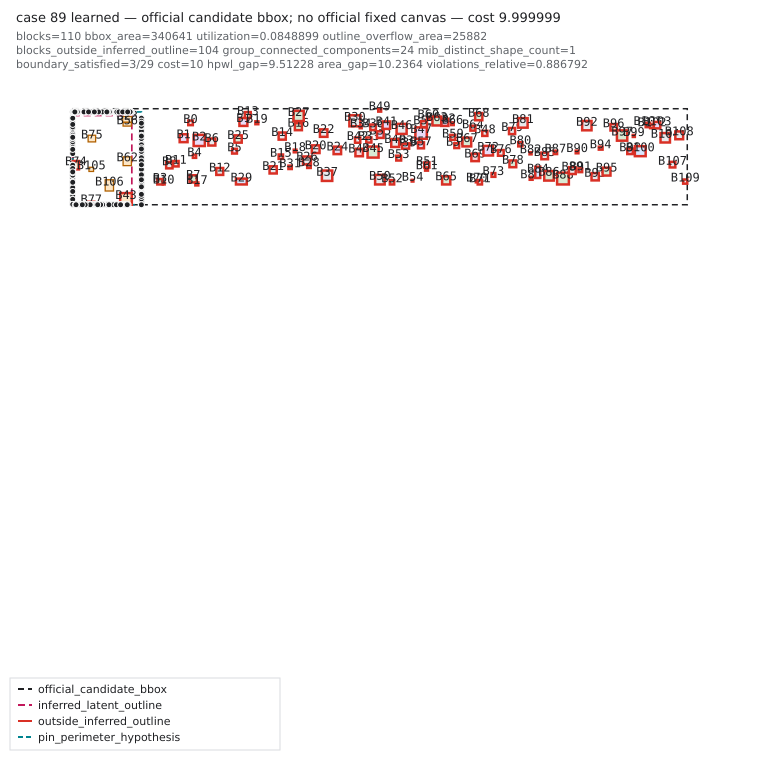

# HCFP-5090 P0/P1 evidence and latent-outline results

Date: 2026-08-12

Branch: `feat/hcfp5090-qor-first`

## Decision

P0 is complete. The visualization now distinguishes the official candidate
bbox from inferred, temporary, pin-perimeter, and training-only gold outlines.
Exact large15 attribution shows that the remaining capped cases are primarily
soft-constraint dominated, while low utilization confirms that exact packing
is still the next geometry target.

P1 implements a deterministic 4--8 hypothesis latent-outline beam using only
official input fields. Its training-only 100,000-case audit passed every
promotion gate; no visible-validation labels enter inference or fitting. The
result promotes the beam as candidate conditioning, not a single hard outline.

## P0 exact large15 attribution

The reconstructed counts and official formula produce:

| Metric | Result |
| --- | ---: |
| Hard feasible | 15/15 |
| Exact uncapped | 8/15 |
| Exact capped | 7/15 |
| Median utilization | 0.255368 |
| Boundary violations | 343 |
| Grouping violations | 199 |
| MIB violations | 0 |

The exact uncapped cases are `85, 87, 91, 92, 95, 96, 97, 99`. The previous
7/15 number used a stricter `cost >= 9.99` competitiveness threshold; case 99
has cost `9.9910749`, which is below the evaluator cap `9.999999`.

The seven capped cases decompose as follows:

| Case | Primary blocker | Uncapped cost | Cap margin | Boundary | Grouping | MIB | Utilization |
| ---: | --- | ---: | ---: | ---: | ---: | ---: | ---: |
| 86 | soft | 10.6564 | -0.0636 | 17 | 24 | 0 | 0.3401 |
| 88 | soft | 25.1526 | -0.9224 | 34 | 22 | 0 | 0.2419 |
| 89 | mixed | 64.0708 | -1.8574 | 26 | 21 | 0 | 0.0849 |
| 90 | soft | 19.4179 | -0.6636 | 23 | 31 | 0 | 0.2923 |
| 93 | soft | 13.7885 | -0.3212 | 23 | 24 | 0 | 0.2456 |
| 94 | soft | 15.0013 | -0.4056 | 24 | 23 | 0 | 0.2557 |
| 98 | soft | 11.9781 | -0.1805 | 5 | 18 | 0 | 0.1584 |

The source benchmark does not preserve raw, projected, and post-repair
geometries separately, so projection attribution is unavailable for this
batch (`projection_evaluable_cases = 0`). This is reported as missing evidence,
not inferred from the final placement.

Artifacts:

```text
artifacts/benchmarks/hcfp5090-large15-attribution-v2.json
artifacts/benchmarks/hcfp5090-large15-attribution-v2.md
docs/evidence/hcfp5090-large15-attribution-v2.json  # tracked snapshot
```

## P0 per-case PNGs

Every image derives `official_candidate_bbox` from the submitted block
extrema. Inferred outlines are overlays rather than official constraints;
blocks outside an inferred outline receive a red border.

| Cases | PNGs |
| --- | --- |
| 85 / 86 | [85](../assets/hcfp5090-p0-large15/case_85.png) · [86](../assets/hcfp5090-p0-large15/case_86.png) |
| 87 / 88 | [87](../assets/hcfp5090-p0-large15/case_87.png) · [88](../assets/hcfp5090-p0-large15/case_88.png) |
| 89 / 90 | [89](../assets/hcfp5090-p0-large15/case_89.png) · [90](../assets/hcfp5090-p0-large15/case_90.png) |
| 91 / 92 | [91](../assets/hcfp5090-p0-large15/case_91.png) · [92](../assets/hcfp5090-p0-large15/case_92.png) |
| 93 / 94 | [93](../assets/hcfp5090-p0-large15/case_93.png) · [94](../assets/hcfp5090-p0-large15/case_94.png) |
| 95 / 96 | [95](../assets/hcfp5090-p0-large15/case_95.png) · [96](../assets/hcfp5090-p0-large15/case_96.png) |
| 97 / 98 | [97](../assets/hcfp5090-p0-large15/case_97.png) · [98](../assets/hcfp5090-p0-large15/case_98.png) |
| 99 | [99](../assets/hcfp5090-p0-large15/case_99.png) |

Representative case:



## P1 inference contract

`infer_outline_hypotheses()` uses total block area, pin perimeter/aspect, fixed
dimensions, and preplaced position/shape anchors. It does not read `fp_sol`.
The audit alone derives `gold_outline = bbox(fp_sol)` for measurement.

Each accepted hypothesis records its source, bounds, utilization, pin and area
residuals, anchor containment, side assignment, confidence, and deterministic
hypothesis ID. Fixed-shape blocks constrain dimensions only; only preplaced
blocks constrain absolute coordinates.

## P1 100k training-only audit

The final audit command is:

```bash
PYTHONPATH=src python scripts/audit_outline_recovery.py \
  --floorset-lite-root artifacts/floorset-v10 \
  --output artifacts/benchmarks/hcfp5090-outline-recovery-large100k.json \
  --limit 100000 --min-blocks 106 --max-blocks 120 --beam 8
```

Final result:

| Gate / metric | Result | Gate |
| --- | ---: | ---: |
| Audited cases | 100,000 | = 100,000 |
| Oracle@8 area error median | 0.5307% | < 1% |
| Oracle@8 area error p95 | 1.5954% | < 3% |
| Oracle@8 gold-side recovery mean | 95.5283% | >= 95% |
| Non-empty beam | 100% | = 100% |
| Accepted hypotheses contain preplaced rectangles | 100% | = 100% |
| Oracle@8 pin-side coverage mean | 99.9995% | diagnostic |
| Oracle@8 gold blocks outside ratio p95 | 0% | diagnostic |

The high-score bucket remained stable: the 33,264 cases with 116--120 blocks
had median/p95 oracle area errors of 0.5668%/1.6224% and mean gold-side recovery
of 95.8130%.

Top-1 is not promoted as a hard envelope. Although its area median/p95 are
0.5324%/1.6210%, top-1 gold-side recovery averages 89.3968% and pin-side
coverage averages 26.2900%. Oracle@8 reaches 95.5283%/99.9995%, confirming that
the information is present in the beam but the current heuristic ranker is not
reliable enough to collapse it to one outline.

Artifact integrity:

```text
artifact:
  artifacts/benchmarks/hcfp5090-outline-recovery-large100k.json
tracked snapshot:
  docs/evidence/hcfp5090-outline-recovery-large100k.json
artifact sha256:
  056b6c6089fca4d2e86e078b7db17781a2cd40c6647024d5b0a50878265fbd86
ordered sample-id sha256:
  01fea6d712d8293dfd7b7f26c378927c5cfdf59fde1b62d0ce9de42c08e1a443
stable summary sha256:
  480f2d4f681ff12957a720d5d977eaa7851f34cef9a510b73e2d684de17c3505
```

The JSON binds the ordered sample list and both inference/audit source files by
SHA-256. The audit rejects validation/visible paths before loading any data.

## P1 runtime contact

When structured seeds exist, the learned lane now tries one deterministic
inside-envelope variant from the beam. It replaces one residual slot, so the
configured candidate budget does not increase. The original topology seed and
the separate analytic incumbent remain in the pool. Empty, uncertain,
incompatible, or invalid hypotheses fail closed to the existing population;
the official exact verifier is unchanged.

## Next step after P1

All P1 gates pass. Proceed to P2 exact-area treemap candidates. The inferred
outline remains candidate conditioning rather than a new official hard
constraint, and the unconstrained incumbent remains available when the beam is
uncertain. The top-1/oracle gap should later train an input-aware outline
selector, but it does not block P2 because all beam hypotheses remain available.
