# HCFP-5090 P6 placement visualization audit

## Evidence

The images in this audit are rendered from the exact full100 reports:

- current portfolio: `artifacts/benchmarks/hcfp5090-p6-btree4-full100.json`
- ablation without B*-Tree: `artifacts/benchmarks/hcfp5090-p6-btree0-full100.json`

Generated assets:

- `docs/assets/hcfp5090-p6-full100/current/case_000.png` through `case_099.png`
- 23 before/after images under `docs/assets/hcfp5090-p6-full100/btree-wins/`
- four block-count contact sheets and one B*-Tree-win contact sheet
- `docs/assets/hcfp5090-p6-full100/placement_tendencies.png`

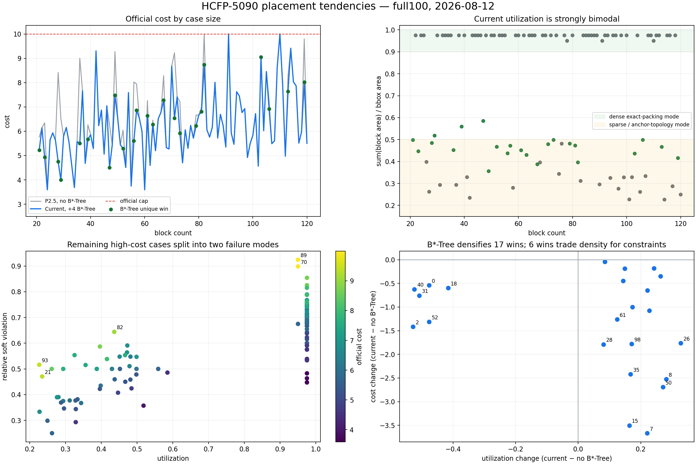

## Observed placement tendencies

### 1. The portfolio is strongly bimodal

The current selected placements split into:

- 55 dense cases with utilization at least 0.90;
- 42 sparse cases with utilization below 0.50;
- only 3 cases between 0.50 and 0.90.

This is a candidate-family effect. Dense winners are usually exact-packing or slicing-like layouts; sparse winners are usually anchor/topology-driven layouts. The selector rarely produces a geometry between these two attractors.

### 2. Dense layouts have a vertical stripe bias

Many medium and large cases form guillotine-like vertical columns. The pattern is especially visible in cases 63-68, 70-72, 74-75, 77, 79, 83, 87-91, 94-95 and 97.

The bias is also visible in block shapes. Across the current full100:

- median candidate bounding-box aspect ratio: 1.50;
- p90 candidate bounding-box aspect ratio: 2.36;
- median of each case's maximum block aspect ratio: 31.66;
- 33/100 cases contain a block with aspect ratio above 100;
- 11/100 contain a block with aspect ratio above 300;
- the largest observed block aspect ratio is 597.92.

The solver is exploiting the absence of a hard soft-block aspect-ratio limit. This helps exact filling, but the hairline blocks and long columns can lock in poor HPWL and grouping topology.

### 3. The two capped cases are not area failures

Cases 70 and 89 are already dense:

| Case | Utilization | Area gap | HPWL gap | Relative soft violation | Cost |
| ---: | ---: | ---: | ---: | ---: | ---: |
| 70 | 0.9499 | 0.0185 | 1.5102 | 0.8983 | 9.999999 |
| 89 | 0.9499 | 0.0041 | 1.4698 | 0.9245 | 9.999999 |

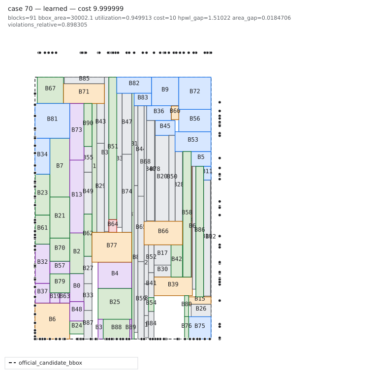

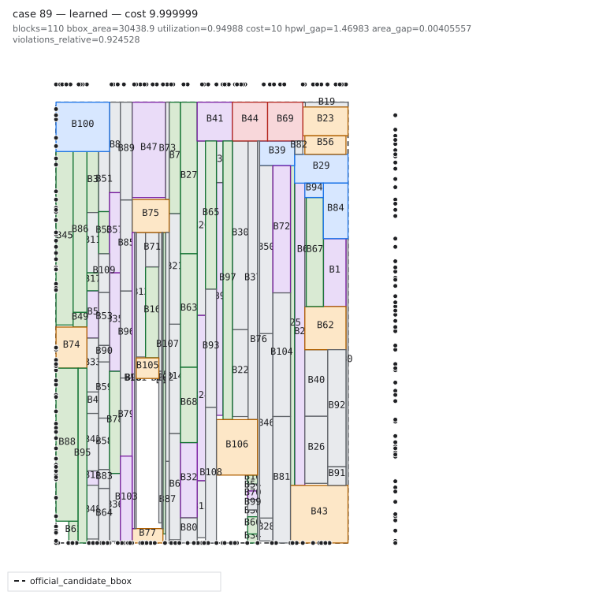

Further compaction is the wrong experiment for these two cases. Their dominant problem is constraint/contact topology, followed by HPWL. Both images show tall stripe packing with little area headroom left.

### 4. Sparse failures are fragmented or anchor-dominated

Cases such as 21, 61, 82, 93 and 98 contain disconnected-looking islands, long empty regions or narrow columns caused by topology and fixed/preplaced/pin anchors.

Case 93 is the clearest remaining area-dominated example: utilization 0.2262, area gap 3.2484 and a large left cluster separated from a lower-right island.

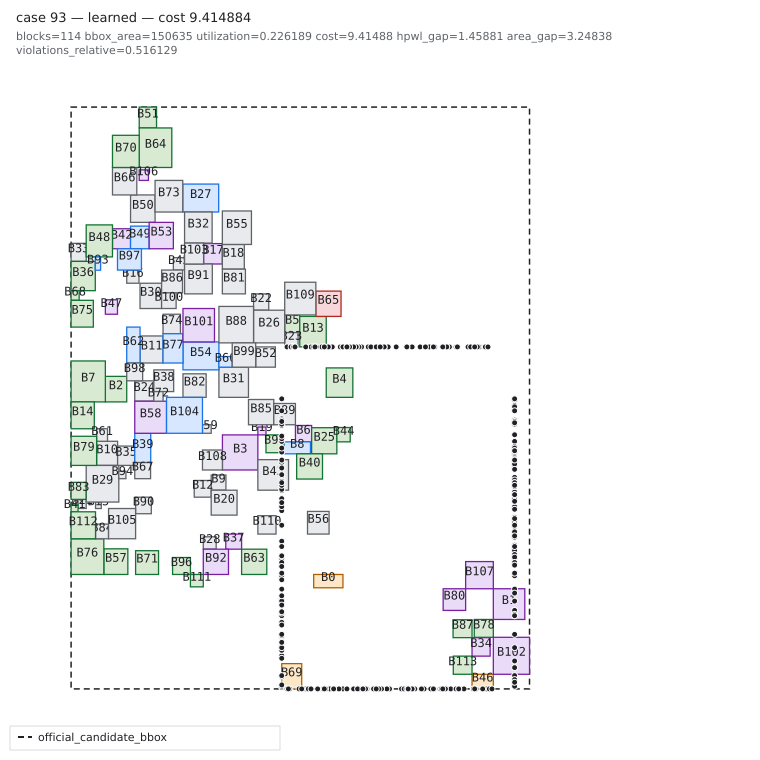

Case 98 improved substantially after adding B*-Tree, but still forms a narrow vertical column with utilization 0.4156 and HPWL gap 2.1455.

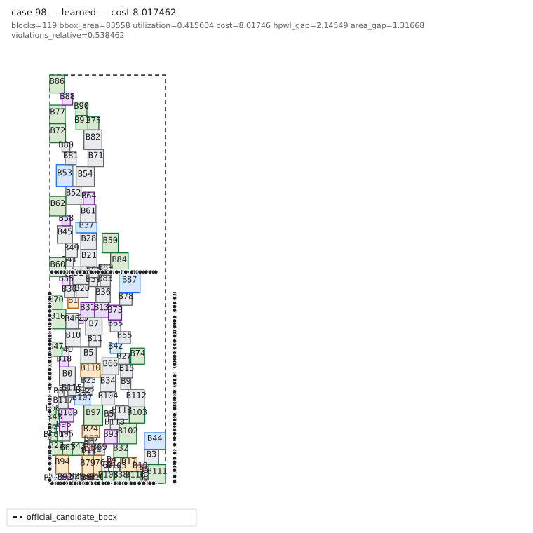

### 5. B*-Tree supplies real geometric diversity

B*-Tree produced 23 improvements and zero regressions on full100.

- 17/23 wins increased utilization, primarily by consolidating scattered layouts.
- 6/23 wins deliberately reduced utilization but still lowered official cost through a better constraint/quality trade-off.
- Unique wins occur in every block-count range, so this is not only a large15 effect.

Case 61 shows the main rescue pattern: a spread-out placement becomes a compact left/bottom structure, moving cost from 9.999999 to 8.739115.

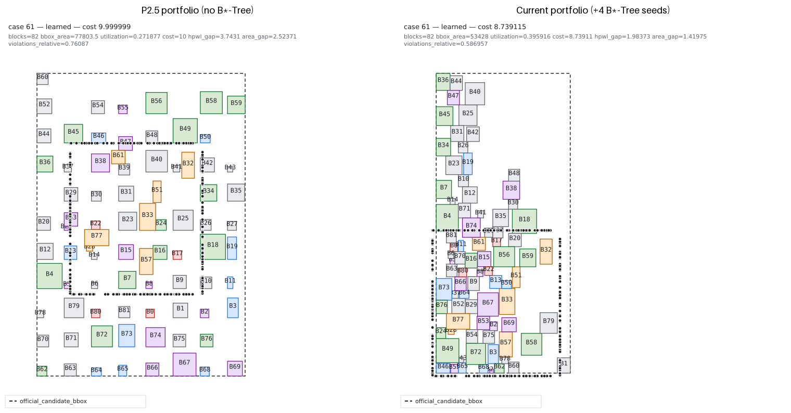

## Contact sheets

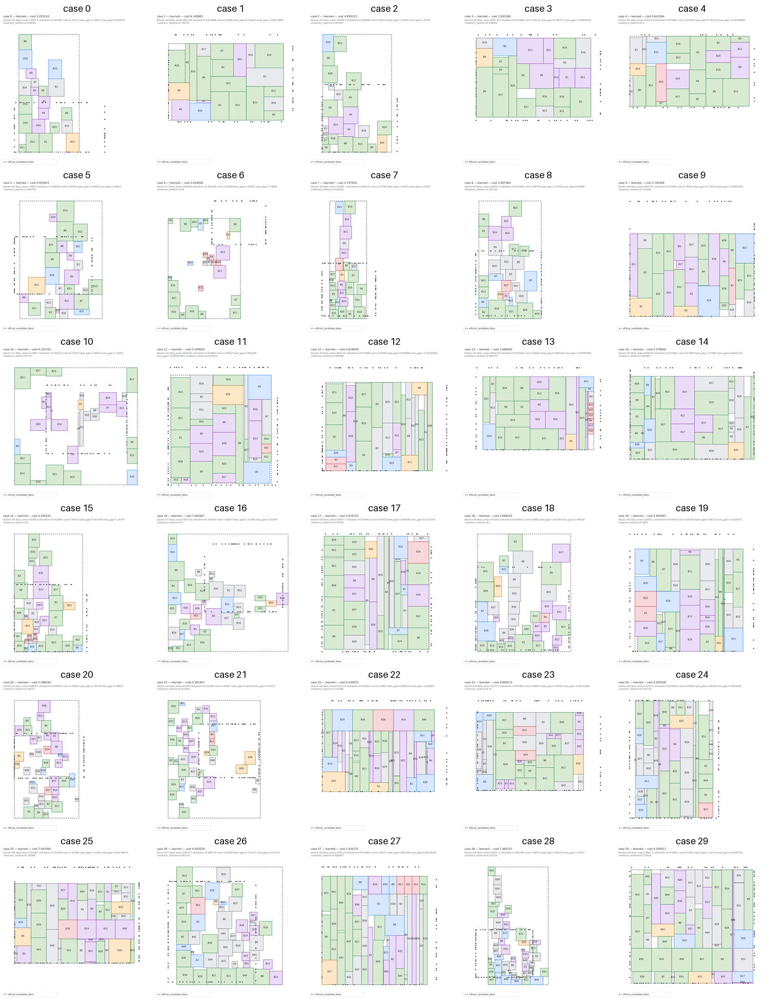

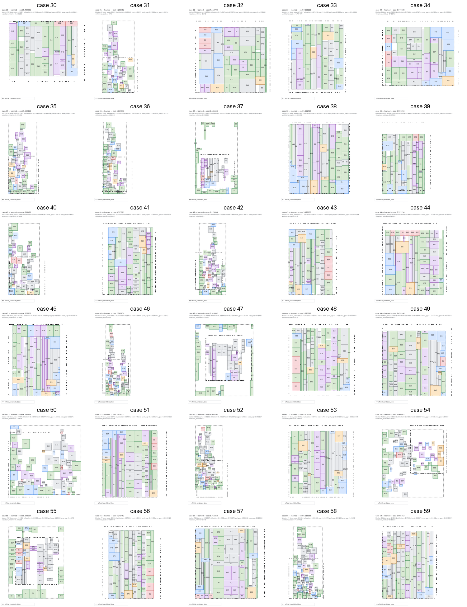

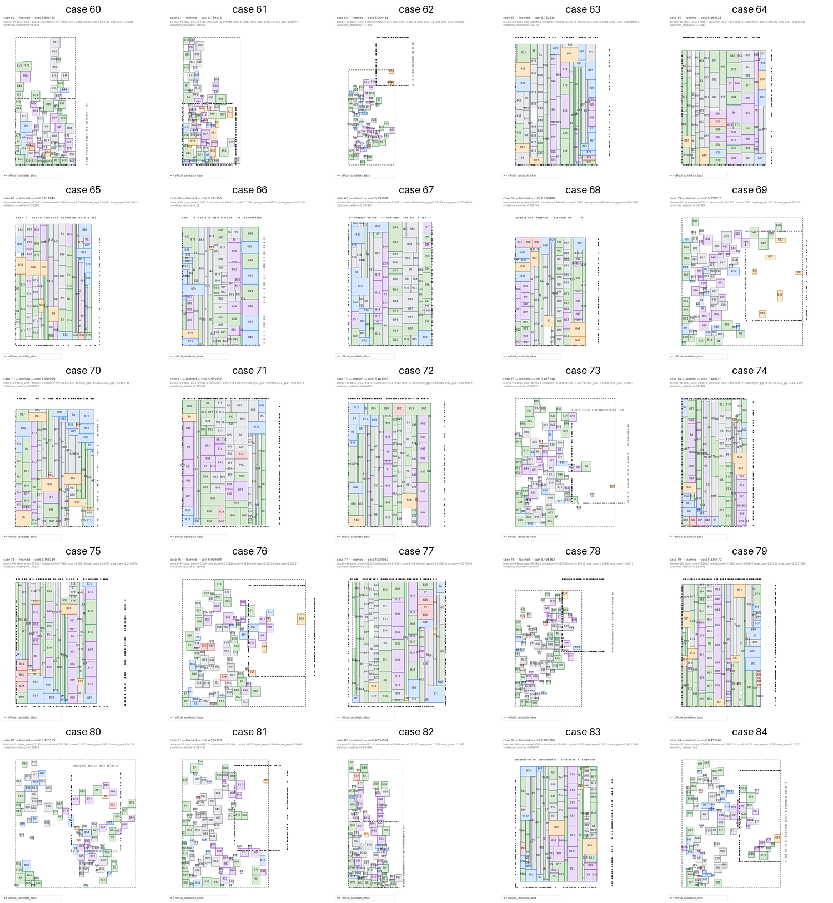

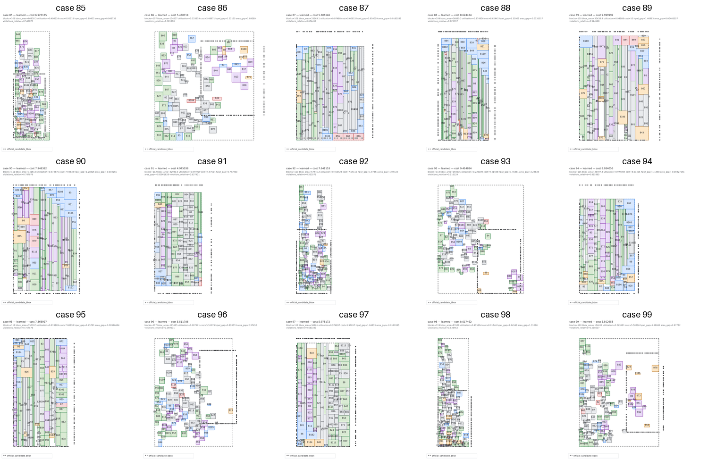

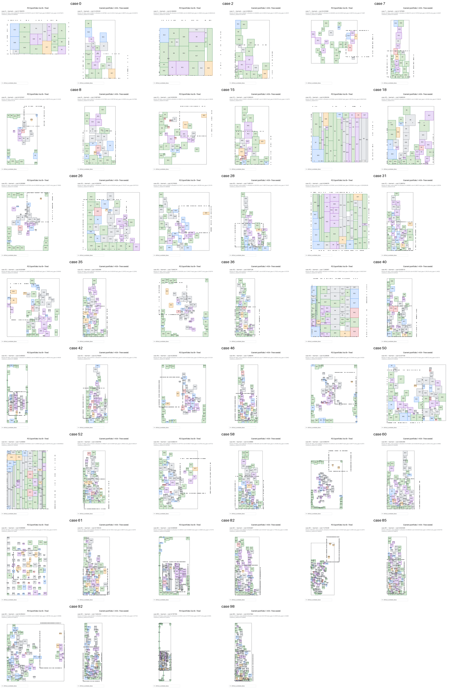

## Decision and next experiments

### Experiment A: fragmentation rescue

Target cases with low utilization, high bbox aspect ratio or spatially separated occupied components. Add or upweight compact B*-Tree/local-tree candidates only for this signature. Start with cases 61, 82, 85, 92, 93 and 98.

Expected chain:

```text
fragmentation proxy decreases
→ bbox area and HPWL decrease
→ sparse cases cross cap without touching dense incumbents
```

### Experiment B: dense stripe breaker

For candidates with utilization above 0.90 but high runtime-visible constraint proxies, do not compact further. Try bounded subtree swaps, column-to-band restructuring, group-contact reinsertion and boundary-order changes. Start with cases 70 and 89.

Expected chain:

```text
group/boundary/MIB proxy decreases
→ V_rel decreases
→ capped dense cases cross cap
```

### Experiment C: aspect-ratio sweep

Run a small `max soft-block aspect ratio = 16 / 32 / 64 / unlimited` ablation. The current extreme slivers are a useful contest specialization only if they improve official cost after repair. Reject a cap that loses exact-packing wins; keep it only if it improves HPWL/contact enough to compensate.

## Overall conclusion

The current solver no longer has one universal placement failure. It has two lanes that require different treatment:

1. **dense stripe cases:** area is solved; attack constraint topology and HPWL;
2. **sparse fragmented cases:** attack consolidation, obstacle decomposition and tree topology.

The next QoR work should route cases between these two experiments instead of adding more generic candidates or more flow steps.
