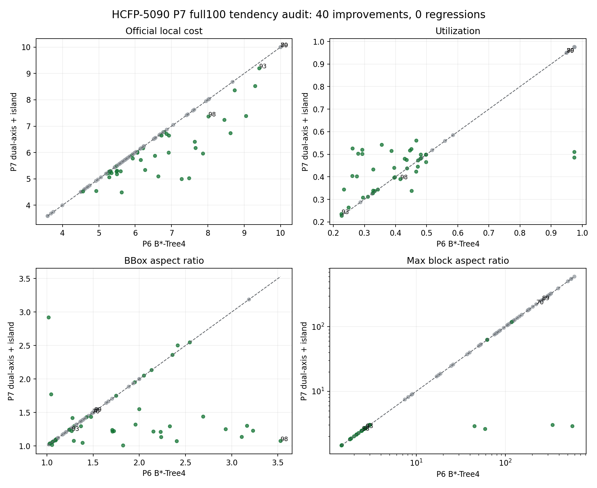
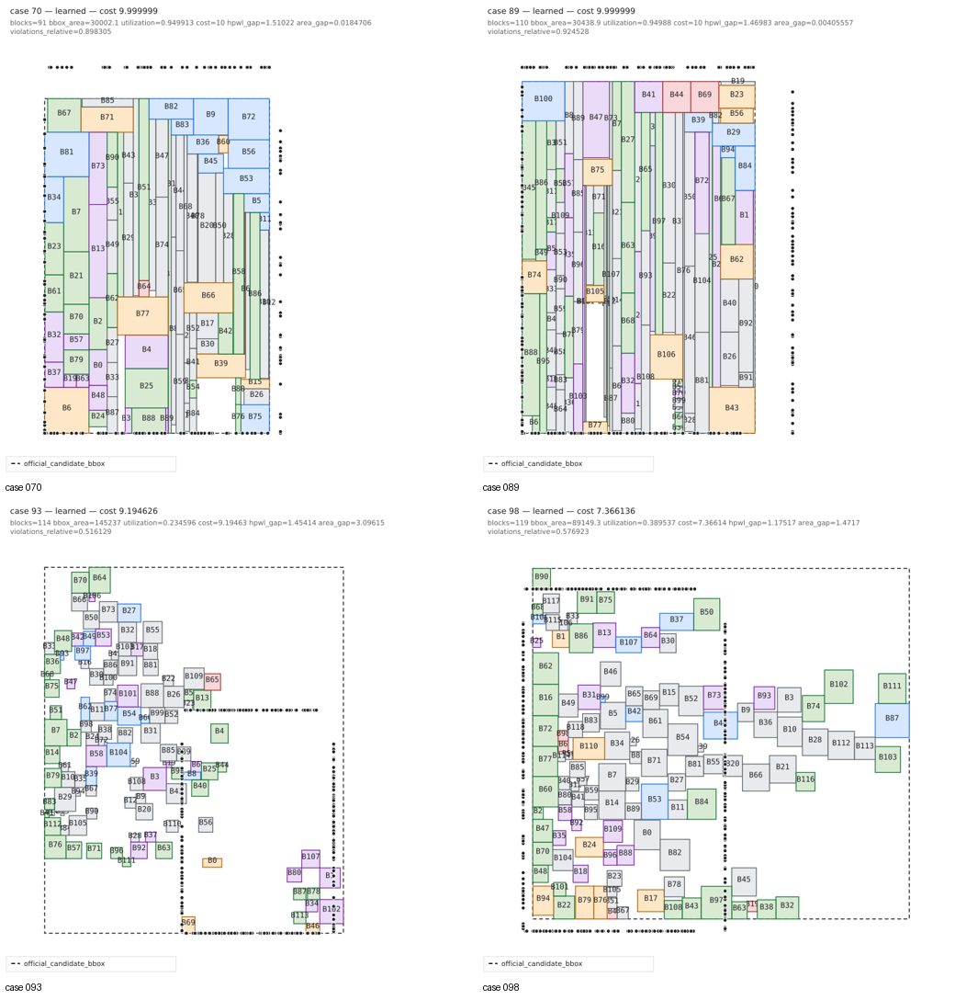

# HCFP-5090 P7 Pareto-frontier completion

## Outcome

P7 keeps the P6 B*-Tree family and adds a true axis-dual decoder plus a sparse
island relocation pass. On the pinned visible full100 evaluator, the resulting
portfolio moves the block-count-weighted local cost from `6.956479` to
`6.554801` while retaining `100/100` hard feasibility and producing zero
per-case regressions.

The official-score assumptions used by this experiment are:

- case weight is `exp(n / 12)`;
- the local pinned evaluator fixes `RuntimeFactor=1`;
- the formal runtime denominator is the median runtime of all submissions for
  the same case, not this submission's own median.

## Ticket ledger

| Ticket | Minimal hypothesis | Result | Decision |
| --- | --- | --- | --- |
| P7-01 invariant transforms | translation/mirror/reciprocal affine can lower P2B HPWL without rebuilding topology | helpers and exact-invariant tests completed; full100 oracle found `0/100` wins because every visible case has a preplaced block | REJECT active lane |
| P7-02 dual-axis B*-Tree | a y-structured/x-compacted decode breaks the x-structured vertical-stripe bias | full100 `6.956479 -> 6.639383`, 23 wins, 0 regressions | KEEP |
| P7-03 role-aware shape/local tree moves | AR variants and bounded subtree moves repair dense stripes | `70/89/93/98` unchanged, including a 32-move sweep | REJECT current ordering |
| P7-04 contact synthesis | synthesize missing group contacts instead of detecting existing contacts | exact-safe obligation MST and rigid challenger implemented; diagnostic score unchanged | MODIFY before reuse |
| P7-05 sparse island relocation | rigid relocation repairs fragmented layouts without damaging island internals | full100 `6.639383 -> 6.554801`; 32 selected improvements and 0 regressions | KEEP |
| P7-06 frame-and-core LNS | keep the bbox witnesses and repair only a dense active core | exact-safe helper completed, but produced zero candidates on `70/89/93/98` | REJECT rigid version |
| P7-07 B*-Tree forest | relocation headroom justifies a bounded anchor-aware forest probe | helper completed; zero accepted candidates on `70/89/93/98` | REJECT current free-strip version |
| P7-08 0.995 area slack | legal area tolerance creates useful packing/contact slack | diagnostic score unchanged | REJECT current treemap-only use |
| P7-09 baseline predictor | predict official area/HPWL baselines and reconstruct candidate cost | area is learnable, HPWL is not yet accurate enough; router eligibility failed | REJECT score selection |
| P7-10 family router | route 0/2/4 dual-axis seeds from runtime-visible case geometry | identical `6.554801` QoR and hard feasibility; one-run p50/p95 improved to `4.013/11.248 s` | KEEP opt-in |

All rejected helpers remain isolated and opt-in. They do not change the verified
default candidate portfolio.

## Main full100 result

| Portfolio | Weighted cost | Hard feasible | Capped | Runtime p50 | Runtime p95 |
| --- | ---: | ---: | ---: | ---: | ---: |
| P6 B*-Tree4 | 6.956479 | 100/100 | 2 | 3.611 s | 10.483 s |
| + dual-axis | 6.639383 | 100/100 | 2 | 4.138 s | 11.015 s |
| + sparse island relocation | **6.554801** | **100/100** | **2** | 4.098 s | 12.274 s |
| + geometry-only family router | **6.554801** | **100/100** | **2** | **4.013 s** | **11.248 s** |

Relative to P6, the final P7 portfolio has 40 improvements, 60 ties and zero
regressions. Relative to dual-axis alone, island relocation adds 32
improvements and zero regressions.

Artifacts:

- `artifacts/benchmarks/hcfp5090-p6-btree4-full100.json`
- `artifacts/benchmarks/hcfp5090-p7-dual-axis-full100.json`
- `artifacts/benchmarks/hcfp5090-p7-dual-island-full100.json`
- `artifacts/benchmarks/hcfp5090-p7-router-dual-island-full100.json`
- `artifacts/benchmarks/hcfp5090-p7-island-budget-oracle-full100.json`

## Router ablation

The geometry-only family router preserves every selected placement and the
exact `6.554801` weighted cost. In one full100 timing run it lowers p50 from
`4.098 s` to `4.013 s` and p95 from `12.274 s` to `11.248 s`. This is a useful
opt-in routing result, but a single timing run is not sufficient to claim a
stable runtime promotion. The baseline-assisted route remains disabled because
the HPWL baseline head failed calibration.

## Baseline-head experiment

Two 2,000-step warm-start experiments trained only the new case-level baseline
head; topology, constraint and B*-Tree parameters were frozen.

| Head input | Area median / p95 absolute relative error | HPWL median / p95 error | Router eligible |
| --- | ---: | ---: | --- |
| frozen scene mean | 4.55% / 11.44% | 69.65% / 443.94% | no |
| scene mean + explicit case aggregates | 4.86% / 8.65% | 160.03% / 1000.29% | no |

The explicit aggregates improved the area tail but worsened HPWL transfer from
FloorSet-Lite training to visible validation. `baseline_selection_margin` is
therefore not enabled. The important guard is capability-based: random or
untrained baseline outputs cannot alter family routing or candidate selection.

## Visual tendency audit



P7 changes the selected geometry in the intended direction without treating
utilization as the objective:

- median utilization: `0.9749 -> 0.9624`;
- p10 utilization: `0.2931 -> 0.3374`;
- median bbox aspect ratio: `1.5000 -> 1.3654`;
- median maximum block aspect ratio: `31.66 -> 17.36`;
- cases with a block AR above 100: `33 -> 31`.

Among the 40 wins, utilization rises in 22 and falls in 7. Bbox aspect ratio
improves in 24 and worsens in 5. This confirms the target is the official-score
Pareto frontier, not a fixed utilization band.

### Remaining diagnostic cases



- Cases 70 and 89 remain dense vertical-stripe layouts. Their utilization is
  already about 0.95; the blockers are relative soft violation around 0.9 and
  HPWL gap around 1.5. Rigid frame/core moves and generic subtree moves cannot
  create a legal contact change in the available whitespace.
- Case 93 is still fragmented. Island relocation improves utilization from
  `0.2262` to `0.2346` and cost from `9.414884` to `9.194626`, but it remains
  area dominated.
- Case 98 demonstrates the value of axis duality: bbox AR drops from `3.53` to
  `1.08` and HPWL gap from `2.15` to `1.18`. Utilization and soft violation get
  slightly worse, yet official cost improves from `8.017462` to `7.366136`.

Per-case PNGs are under
`docs/assets/hcfp5090-p7-dual-island-full100/cases/`. Contact sheets cover all
100 cases and the 40 P7 wins.

## Method decisions

### KEEP

1. Generate x-compacted and y-compacted candidates from each predicted
   B*-Tree; retain both behind the incumbent guard.
2. Run island relocation only for selected layouts with utilization below
   0.50. Preserve internal island geometry and preplaced blocks exactly.
3. Keep exact feasibility and candidate-funnel selection as final admission
   gates.

### MODIFY

Contact synthesis must stop trying only rigid translations. Dense cases require
a topology-changing operation that can create a contact while holding the
frame fixed: group-macro detach/reinsert, boundary witness reassignment, or a
low-degree bridge block whose area-preserving shape is constructed together
with the local packing.

### REJECT

Do not enable global invariant transforms on this dataset, the current AR/local
move pool, rigid frame/core, current forest free-strip packing, treemap-only
0.995 slack, or baseline-assisted score selection. Each failed its smallest
informative experiment.

## Next experiment

The next QoR experiment should target only dense high-soft-violation cases:

```text
fixed bbox witnesses
-> choose one disconnected group obligation
-> detach the smallest low-degree group subtree
-> reinsert it with an exact side contact
-> deterministic local B*-Tree decode
-> accept by official-like proxy and exact verifier
```

This is narrower than another global model/training pass and directly attacks
the remaining cases 70 and 89.
