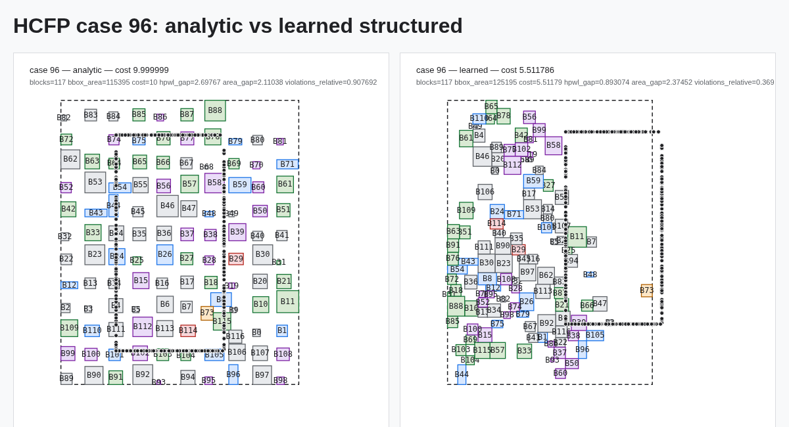

# HCFP-5090 large-case QoR-first result — 2026-08-12

## Decision

For 106--120 block cases, use the large-case structure checkpoint with 16
Sequence-Pair topology seeds and 16 constraint seeds. Keep the smaller-case
checkpoint unchanged.

The useful gain came from training the structure that controls candidate
geometry, then enabling the already implemented constraint construction. More
absolute-center regression and overlap-only fine-tuning did not improve the
active topology lane.

## Training recipe

```text
parent:      hcfp5090-q2-constraints-s1000-seed5090.pt
data:        FloorSet training source only
block range: 106--120
stage:       structure
steps:       3000
population:  8
learning rate: 3e-5
EMA:         off
seed:        6501
```

Checkpoint:

```text
artifacts/checkpoints/hcfp5090-q2-structure-large-s3000-seed6501.pt
```

The structure loss fell from `1.663877` to `0.895539`.

## Exact public-large result

Command configuration:

```text
cases:            85--99
topology seeds:   16
constraint seeds: 16
flow:             off
collective:       off
```

Report:

```text
artifacts/benchmarks/
  hcfp5090-q2-structure-large-s3000-seed6501-
  constraints16-official-large15-exact.json
```

Results:

| Metric | Analytic | Learned structured |
| --- | ---: | ---: |
| Hard feasible | 15/15 | 15/15 |
| Weighted capped cost | 9.999999 | 8.822391 |
| Cases below exact evaluator cap | 0 | 8 |
| Runtime p50 | 0.390 s | 6.015 s |
| Runtime p95 | 0.799 s | 7.803 s |

The eight mathematically uncapped learned cases were 85, 87, 91, 92, 95, 96,
97, and 99. The earlier benchmark summary reported seven because it used a
conservative `cost >= 9.99` competitiveness threshold; case 99 has exact cost
`9.9910749`, so it is below the evaluator cap even though it fails that older
threshold.
Case 96 reached the best observed cost in this batch at `5.511786`.

## Per-case placement visualizations

Each PNG compares the analytic placement (left) with the selected learned
structured placement (right). The title line records the exact official cost;
the metric line records HPWL gap, area gap, and relative soft violations.

| Cases | Comparisons |
| --- | --- |
| 85 / 86 | [case 85](../assets/hcfp5090-qor-large15/case_85_comparison.png) · [case 86](../assets/hcfp5090-qor-large15/case_86_comparison.png) |
| 87 / 88 | [case 87](../assets/hcfp5090-qor-large15/case_87_comparison.png) · [case 88](../assets/hcfp5090-qor-large15/case_88_comparison.png) |
| 89 / 90 | [case 89](../assets/hcfp5090-qor-large15/case_89_comparison.png) · [case 90](../assets/hcfp5090-qor-large15/case_90_comparison.png) |
| 91 / 92 | [case 91](../assets/hcfp5090-qor-large15/case_91_comparison.png) · [case 92](../assets/hcfp5090-qor-large15/case_92_comparison.png) |
| 93 / 94 | [case 93](../assets/hcfp5090-qor-large15/case_93_comparison.png) · [case 94](../assets/hcfp5090-qor-large15/case_94_comparison.png) |
| 95 / 96 | [case 95](../assets/hcfp5090-qor-large15/case_95_comparison.png) · [case 96](../assets/hcfp5090-qor-large15/case_96_comparison.png) |
| 97 / 98 | [case 97](../assets/hcfp5090-qor-large15/case_97_comparison.png) · [case 98](../assets/hcfp5090-qor-large15/case_98_comparison.png) |
| 99 | [case 99](../assets/hcfp5090-qor-large15/case_99_comparison.png) |

Representative cap-cross result (case 96):



The pictures show the current learned tendency clearly: topology seeds pack
movable blocks into a dense cluster while fixed/preplaced anchors and pins can
stretch the global bounding box. Constraint construction substantially lowers
soft violations, but bbox compaction around distant anchors remains the next
geometry bottleneck.

## Ablation result

With topology seeds but no constraint seeds, the same checkpoint remained
capped on 14/15 cases and had weighted cost `9.998999`. Enabling constraint
seeds reduced the soft-violation ratio enough to cross the exact cap on eight
cases (seven under the older `9.99` competitiveness threshold).

The absolute-initializer experiment learned target centers successfully, but
its large-case topology oracle remained behind the Q2 topology checkpoint.
The ineffective aspect-clamp experiment was discarded instead of entering the
runtime path.

## Runtime policy

`HCFP_CHECKPOINT` remains the general checkpoint. For cases with at least 106
blocks, runtime uses `HCFP_LARGE_CHECKPOINT` when set and enables 16 topology
plus 16 constraint seeds by default. The threshold and seed counts remain
environment-overridable for contest sweeps.

## Next QoR target

Do not add a larger model yet. Train/replay the near-cap and still-capped large
cases, with priority on reducing grouping, boundary, and MIB violations while
preserving the current topology geometry. Runtime reduction comes after the
next cap-cross gain.

## Constraint-only follow-up

A `constraints` training stage was added so contact, boundary, and MIB heads
can be fine-tuned without moving the encoder or Sequence-Pair heads. A first
2,000-step large-case run at learning rate `1e-4` was not promoted:

```text
parent weighted cost:          8.822391
constraint-only step 500:      9.159662
constraint-only step 2000:     8.900946
hard feasibility:              15/15 for every run
```

The stage remains useful for smaller learning-rate and replay-targeted sweeps,
but the active large checkpoint stays the 3,000-step structure model.
